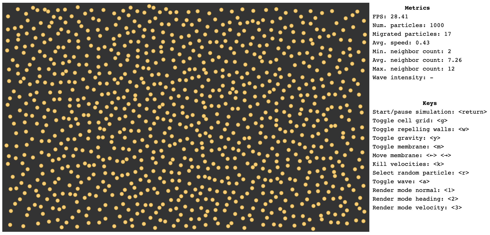

# Particles

This is an experiment I made to try P5.js, a library I came to know after watching [Daniel Shiffman's](http://shiffman.net/) classes on Youtube.

You can just go try it yourself online: http://luciopaiva.com/particles

The experiment simulates thousands of particles, each exerting influence over (and being influenced by) its nearest neighbors. The simulation uses a technique known as bin lattice spatial subdivision (a kind of a simpler quad-tree algorithm - just a grid, really) to make things scale when thousands of particles are being simulated.

# To do

- toggle force mode:
  1. inverse gravitation force (inversely proportional to the square distance between each pair of particles)
  2. nearby springs (find nearest n, calculate average distance d and use it as a the rest length of a spring between
     the particle and each of the n neighbors)
- fix the nearest n when considering neighbors?
- along with the proposal above, also adjust grid based on how many particles are being simulated, so we can scale
  (otherwise, as the density increases, grid cells would contain more and more particles)
- show stats for each cell (index and num of particles)
- press spacebar to introduce a batch of particles, all travelling at the same speed and heading
  (alternatively, each spacebar press would introduce a single one, and the user could press it several times to create
   a stream of particles)
- add energy loss (heat?) when particles travel (and maybe when then collide)
